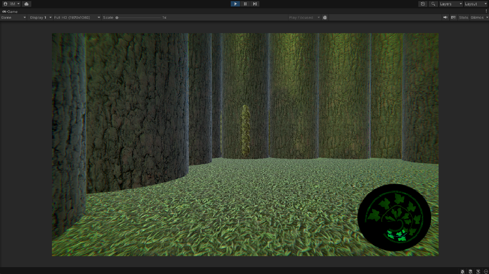

[Link to Github Repo](https://github.com/RiverMatsumoto/ProjectLabyrinth)

In my spare time, I am building a dungeon crawler game inspired by old dungeon crawlers in Unity. Another inspiration for this game is Etrian Odyssey which is where some mechanics and aesthetics come from. 

Throughout this process, I focused a lot on project architecture to help scale the project although I do have regrets about some decisions I made along the way. Enough regrets that I am considering rewriting the project and taking along well written components with me. I learned a lot throughout the process of building this project, and I have a small list of things that I have learned:

### 1. Globally accessible systems should know **nothing** about scene specific objects

When adding global systems such as MapSystems or BattleSystems, I didn't realize how attrocious it is to have to think about whether the global system is in a certain scene or not. 

For example, in the Labyrinth scene, my MapSystem had a reference to the player in the scene for managing positions. The player's responsibility is only to move around and interact with the labyrinth. However, since the player was not a global DontDestroyOnLoad GameObject, the MapSystem would break if the scene changed. So what did I decide to do?

**I made the player a DontDestroyOnLoad GameObject along with the global systems.**

I know, I know. Not the best decision. I kept doing this whenever something would happen and it makes state management a pain. The real solution was to treat the MapSystem as a service that takes in data to do what it needs to, then return a result. This would make the project a lot cleaner since I know that the global system will do exactly what you tell it to.

### 2. RPG games need a robust menu navigation system

It took a while for me to come around on this, but RPG menu transitions need to be clean and easy to work with when developing a game. It hurts when implementing a feature, then having to do a side quest for an hour for UI that has no "go back" or "undo" features.

 The functionality that I had a hard time dealing with was when UI components should be interactable or not. For example, your menu might have two section of UI that are visible, except one section isn't interactable. This would be solved by creating some sort of MenuController class with multiple UI sections. Each UI section should know where to go when the back button is pressed.

### 3. Use raw C# classes/structs for globally state heavy objects

This one is a bit simpler. One thing I commonly ran into was that MonoBehavior gameobjects felt a bit more difficult to work with when they had too much state in them. It's a lot easier to create a data structure that can be held by a scriptable object that lives in your assets folder. One example of how I used this was with the player's party. I had a tendency to make MonoBehaviors global singletons that stored data, but I felt it was more appropriate to store them as assets because there is no tight coupling to a specific type when accessing the data.

### 4. Complex frameworks are hard

I played around with using dependency injection with [Zenject](https://github.com/modesttree/Zenject) in Unity, however, I think my lack of experience caused my implementations to be quite poor. The main issue I ran into is that it takes a lot of time to bind instances and I felt like I was misusing it.

One thing I really like about Zenject was it's factory api. The fact it would inject dependencies for you while using factories was amazing to me. Zenject does feel a bit overkill for a project like mine however, but currently I am enjoying it.

### Conlusion

There is a lot of work to be done in this project. In its current state, I need to implement more fundamental systems such as a menu system, map loading system, and battle system. Overall I am happy with how much I have learned! However, I might switch from using unity to either Godot or Unreal Engine due to the current state of Unity's developer relations.