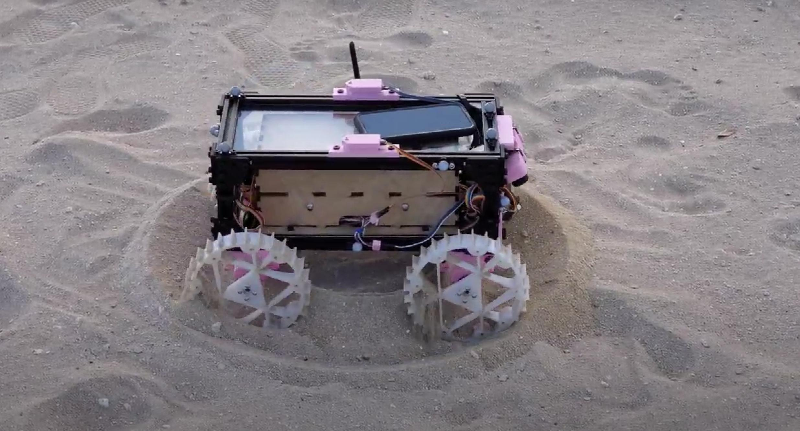

I built a teleoperated rover for the purposes of terramechanics modeling research at the RoSE Lab (Robotics Space Exploration Lab) at UH Manoa. This rover's software was developed ROS (Robotics Operating System).